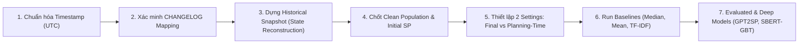

# Dự báo Story Point tại Thời điểm Lập kế hoạch Agile với Kiểm soát Rò rỉ Thông tin Tương lai
> **Agile Story Point Estimation at Planning Time with Temporal & Data Leakage Control**

[](https://github.com/snowflake-vibing/NCKH_Johnny_Snowflake)
[](https://github.com/SOLAR-group/TAWOS)
[]()
[](LICENSE)

---

## 📌 Thông tin Đề tài & Nhóm Nghiên cứu

* **Đơn vị thực hiện:** Khoa Hệ thống Thông tin — Trường Đại học Công nghệ Thông tin, ĐHQG-HCM (UIT - VNUHCM)
* **Báo cáo:** Báo cáo nghiên cứu lần 2 (2026)
* **Giảng viên hướng dẫn:** ThS/TS. Tạ Việt Phương
* **Thành viên nhóm (Nhóm 3):**
  1. **Phan Ngọc Đức Huy** — MSSV: `24520695`
  2. **Lê Thành Hiệu** — MSSV: `24520496`

---

## 🎯 1. Bối cảnh & Vấn đề Nghiên cứu

Trong quy trình **Agile / Scrum**, việc ước lượng nỗ lực (Story Point) giúp đội phát triển đánh giá độ phức tạp tương đối của công việc trong buổi họp *Sprint Planning*. Tuy nhiên, hầu hết các nghiên cứu học máy (Machine Learning/Deep Learning) hiện nay như *Deep-SE*, *GPT2SP*, *SBERT + GBT* đều sử dụng dữ liệu tĩnh dạng **Final Snapshot** — tức dữ liệu được thu thập sau khi issue đã hoàn thành.

### 🔴 Nguy cơ Rò rỉ Thông tin Tương lai (Future-Information / Temporal Leakage):
* Sau buổi họp planning, title và description của Jira issue thường xuyên được lập trình viên bổ sung nguyên nhân lỗi, giải pháp kỹ thuật hoặc tên module chi tiết.
* Nếu huấn luyện mô hình trên dữ liệu sau khi hoàn thành, mô hình sẽ nhìn thấy thông tin mà nhóm phát triển **chưa thể có tại thời điểm ước lượng**. Điều này làm tăng độ chính xác biểu kiến (overoptimistic results) nhưng không ứng dụng được thực tế.

---

## 🔍 2. Định nghĩa Bài toán (Task Definition v1)

| Thành phần | Định nghĩa của Nhóm Nghiên cứu |
| :--- | :--- |
| **Problem** | Hỗ trợ ước lượng nỗ lực trong Sprint Planning và loại bỏ triệt để sai lệch do thông tin phát sinh sau planning (*Temporal Leakage*). |
| **Target User** | Scrum Team (Developers, Product Owner, Scrum Master) dùng kết quả làm căn cứ tham khảo thảo luận. |
| **Unit of Analysis** | Một Jira Issue / User Story đủ điều kiện được chấm Story Point. |
| **Prediction Task** | Bài toán **Supervised Regression** dự báo một giá trị Story Point (dạng số thực/điểm tương đối). |
| **Estimation Time** | Mốc `SP_Estimation_Date` (thời điểm Story Point lần đầu được điền). |
| **Ground Truth** | Initial Story Point tại mốc estimation. Khôi phục giá trị ban đầu từ `CHANGELOG` nếu bị sửa đổi sau đó. |
| **Input Available** | Title, Description, Issue Type, Priority, Components tại thời điểm **không muộn hơn** `SP_Estimation_Date`. *(Cấm dùng: Status=Closed, Resolution Date, Comments phát sinh, Assignee tương lai)*. |
| **Nghiên cứu Cốt lõi (RQ)** | *Việc dựng lại trạng thái Jira issue đúng tại `SP_Estimation_Date` làm thay đổi độ chính xác được báo cáo của mô hình dự báo như thế nào so với Final Snapshot?* |

---

## 📊 3. Dữ liệu & Kết quả Thống kê EDA (TAWOS v1.1)

Nguồn dữ liệu chính là **TAWOS Dataset v1.1** (SOLAR Research Group - UCL) gồm **458.232 issues** thuộc **39 dự án** và **12 Jira Repositories**.

### Key EDA Insights & Bằng chứng Leakage:

1. **Độ phủ Story Point:**
   * **63.011 issues** (chiếm `13,75%`) thực sự được chấm Story Point.
   * **395.221 issues** (`86,25%`) không được chấm điểm (các task quản lý lỗi hàng ngày) $\rightarrow$ Cần lọc bỏ population không phù hợp.
2. **Độ khuyết văn bản:**
   * `29.128 issues` (`6,36%`) bị thiếu trường Description.
3. **Minh chứng Rò rỉ Thông tin Tương lai trong Dữ liệu thực tế:**
   * **11.969 issues** (tương đương `~19%` số issue có Story Point) bị thay đổi nội dung văn bản (title/description) sau thời điểm estimation.
   * Tổng cộng **51.485 lượt thay đổi văn bản** diễn ra sau khi estimate.
   * **Trung vị độ trễ:** `2,30 ngày` (`55,30 giờ`). Trong đó:
     * `25%` lượt thay đổi xảy ra nhanh trong vòng `0,38 giờ`.
     * **14.883 lượt thay đổi** diễn ra trong **chưa đầy 1 giờ** sau khi họp estimate.
     * `75%` lượt thay đổi kéo dài tới `34,88 ngày`.

> 💡 **Kết luận EDA:** Future-Information Leakage là nguy cơ thực tế có quy mô rất lớn trong dữ liệu Jira, không phải giả định lý thuyết.

---

## 🧪 4. Kết quả Tái lập (Artifact Reproduction — GPT2SP)

Nhóm đã thực hiện tái lập một phần kết quả của bài báo công bố trên **IEEE TSE 2023**:
> *Fu & Tantithamthavorn (2023), "GPT2SP: A Transformer-Based Agile Story Point Estimation Approach"*

* **Tập dữ liệu thử nghiệm:** Project **Spring XD** (3.526 issues; Chia 60/20/20 chronological: `2.115 train` / `705 val` / `706 test`).
* **Môi trường:** Google Colab Tesla T4, PyTorch 2.11.0, Transformers 4.39.3, Checkpoint `MickyMike/0-GPT2SP-springxd`.

### Bảng So sánh Kết quả Tái lập:

| Chỉ số / Metric | Kết quả Paper | Chạy lại (Replication) | Đánh giá Trạng thái |
| :--- | :---: | :---: | :--- |
| **Dataset rows** | 3.526 | 3.526 | ✅ Khớp hoàn toàn |
| **Train/Val/Test Split** | 2.115 / 705 / 706 | 2.115 / 705 / 706 | ✅ Khớp hoàn toàn |
| **Median Baseline MAE** | `1,72` | `1,7153` | ✅ Khớp (sau làm tròn) |
| **GPT2SP Checkpoint MAE** | `0,96` | `1,7330` | ⚠️ Chưa khớp (Partial Reproduction) |
| **GPT2SP MdAE** | N/A | `1,2994` | 📝 Ghi nhận bổ sung |
| **Cải thiện so với Median** | ~44.2% | -1.03% | 🔍 Kém hơn Median baseline trên checkpoint |

#### 📌 Phân tích nguyên nhân lệch kết quả:
1. **Khác biệt Input:** Bài báo mô tả kết hợp `Title + Description`, nhưng Notebook/Artifact công khai của tác giả chỉ dùng riêng `Title` (`max_length=20`).
2. **Khác biệt Môi trường:** Thay đổi về phiên bản thư viện Transformer/PyTorch ảnh hưởng đến pooling, padding và serialization checkpoint.
3. **Nguyên tắc khoa học:** Nhóm ghi nhận trung thực sai lệch này dưới dạng **Partial Reproduction**, làm tiền đề cho các thí nghiệm tự huấn luyện lại từ đầu.

---

## 🗺️ 5. Kế hoạch Thực nghiệm Tiếp theo (Roadmap)



| Bước | Công việc | Kết quả Cần có |
| :---: | :--- | :--- |
| **1** | Chuẩn hóa Timestamp | Chuyển UTC, sửa lỗi parse năm bất thường, lọc `estimation < created`. |
| **2** | Xác minh Change_Log | Chuẩn hóa field name cho summary/title/description và Story Point. |
| **3** | Dựng Historical Snapshot | Reconstruct từng field tại `SP_Estimation_Date`, kiểm thử bằng case history. |
| **4** | Chốt Population | Lọc issue có Initial SP hợp lệ và đầy đủ input tại thời điểm estimation. |
| **5** | Tạo 2 Setting Thử nghiệm | So sánh **Final Snapshot** vs **Planning-Time Snapshot** trên cùng issue/split. |
| **6** | Chạy Baseline | Median, Mean, Random và TF-IDF baseline trước khi chạy mô hình sâu. |
| **7** | Đánh giá Thống kê | MAE / MdAE / SA theo từng project, tính Bootstrap CI và paired test. |
| **8** | Mô hình Mở rộng | Huấn luyện lại GPT2SP và SBERT-GBT trên pipeline kiểm soát leakage. |

---

## 📂 6. Cấu trúc Thư mục Dự án

```text
.
├── README.md                 # Tài liệu tổng quan & Insights repository
├── LICENSE                   # Giấy phép nguồn mở MIT
```

---

## 📚 7. Nguồn Tham khảo Chính (References)

1. **Tawosi et al. (2022)** — *Agile Effort Estimation: Have We Solved the Problem Yet? Insights From a Replication Study*, IEEE TSE. DOI: `10.1109/TSE.2022.3204902`.
2. **Fu & Tantithamthavorn (2023)** — *GPT2SP: A Transformer-Based Agile Story Point Estimation Approach*, IEEE TSE. DOI: `10.1109/TSE.2022.3158252`.
3. **Kapoor & Narayanan (2023)** — *Leakage and the Reproducibility Crisis in Machine-Learning-Based Science*, Patterns. DOI: `10.1016/j.patter.2023.100804`.
4. **Pasuksmit et al. (2024)** — *A Systematic Literature Review on Reasons and Approaches for Accurate Effort Estimations in Agile*, arXiv:2405.01569.
5. **SOLAR Group TAWOS Dataset v1.1** — [GitHub Repository](https://github.com/SOLAR-group/TAWOS).

---
© 2026 **Nhóm 3 — Khoa Hệ thống Thông tin, Trường ĐH Công nghệ Thông tin, ĐHQG-HCM.**
