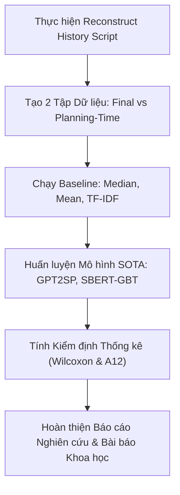

# 📋 Requirements_4: Phân tích Khoảng hẫng & Kế hoạch Phát triển (Github Gap Analysis & Roadmap)

> **Bảng tổng hợp đối chiếu Khoảng hẫng (Gap Analysis) giữa Toàn bộ Yêu cầu NCKH (`Huong 3 b2.pdf`, `Research_Nhom_3.pdf`) và Thực trạng Sản phẩm trên GitHub Repository (`NCKH_Johnny_Snowflake`), kèm Kế hoạch Triển khai (Roadmap).**

---

## 📊 1. Bảng Ma trận Khoảng hẫng Tổng hợp (Master Gap Matrix)

| STT | Hạng mục Yêu cầu NCKH | File Yêu cầu Nguồn | Sản phẩm Hiện tại trên GitHub | Trạng thái | Hành động Cần làm (Action Item) |
| :---: | :--- | :--- | :--- | :---: | :--- |
| **1** | Task Definition v1 | `Huong 3 b2.pdf` (Slide 5) `Research_Nhom_3.pdf` (Ch. 1) | File [OVERVIEW.md](file:///d:/NCKH_3/OVERVIEW.md) & [Requirements_1](file:///d:/NCKH_3/requirements/Requirements_1_Task_Definition.md) | ✅ **100%** | Duy trì đồng bộ khi cập nhật RQ mới. |
| **2** | Dataset Card v1 (TAWOS) | `Huong 3 b2.pdf` (Slide 5) `Research_Nhom_3.pdf` (Ch. 2) | File [OVERVIEW.md](file:///d:/NCKH_3/OVERVIEW.md) & [data/README.md](file:///d:/NCKH_3/data/README.md) | ✅ **100%** | Cập nhật thêm nếu TAWOS có bản vá mới. |
| **3** | Literature Matrix (5-9 bài) | `Huong 3 b2.pdf` (Slide 6) `Research_Nhom_3.pdf` (Ch. 7) | Thư mục [paper-information/](file:///d:/NCKH_3/paper-information/) chứa 5 file `.md` | ✅ **100%** | Bổ sung bài báo mới khi tiến hành mở rộng. |
| **4** | EDA cơ bản TAWOS | `Huong 3 b2.pdf` (Slide 7) `Research_Nhom_3.pdf` (Ch. 3) | Kịch bản [data/EDA_TAWOS.ipynb](file:///d:/NCKH_3/data/EDA_TAWOS.ipynb) | ✅ **100%** | Chạy kiểm thử tự động trên máy local. |
| **5** | EDA N3 (Change Log & Leakage) | `Huong 3 b2.pdf` (Slide 8) `Research_Nhom_3.pdf` (Ch. 3) | Notebook [data/EDA_TAWOS.ipynb](file:///d:/NCKH_3/data/EDA_TAWOS.ipynb) (Cell 7-9) | ✅ **100%** | Trích xuất biểu đồ EDA dạng hình ảnh. |
| **6** | Báo cáo Tái lập GPT2SP | `Huong 3 b2.pdf` (Slide 6-7) `Research_Nhom_3.pdf` (Ch. 4) | Bảng so sánh tại [OVERVIEW.md](file:///d:/NCKH_3/OVERVIEW.md) (Mục 4) | ✅ **100%** | Đóng gói notebook tái lập công khai. |
| **7** | Pipeline Reconstruct History | `Huong 3 b2.pdf` (Slide 4) `Research_Nhom_3.pdf` (Ch. 5) | Đã lập luận tại [OVERVIEW.md](file:///d:/NCKH_3/OVERVIEW.md) (Roadmap) | ⚠️ **50%** | Xây dựng script Python dựng trạng thái `SP_Estimation_Date`. |
| **8** | Chạy thử nghiệm 2 Settings | `Huong 3 b2.pdf` (Slide 4) `Research_Nhom_3.pdf` (Ch. 5) | Đã lập khung thử nghiệm trong Roadmap | ⚠️ **30%** | Chạy mô hình trên Final vs Planning-Time snapshot. |
| **9** | Đánh giá Kiểm định Thống kê | `Huong 3 b2.pdf` (Slide 6) `Research_Nhom_3.pdf` (Ch. 5) | Quy tắc tại [ai-skills/RULE.md](file:///d:/NCKH_3/ai-skills/RULE.md) | ⚠️ **30%** | Tính Wilcoxon Rank-Sum test & Vargha-Delaney A12. |

---

## 🗺️ 2. Kế hoạch Hành động Kế tiếp (Actionable Roadmap)

---
© 2026 **Nhóm 3 — NCKH Agile Story Point Estimation Project**
